<p align="center">
  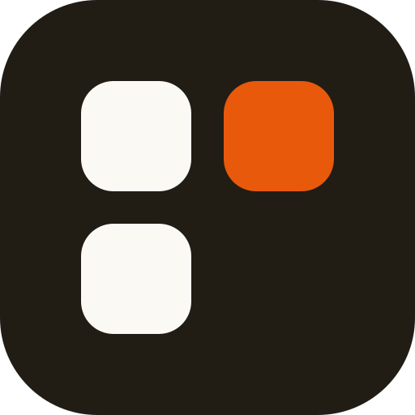
</p>

<h1 align="center">Skillbox</h1>

<p align="center">同一套 Skill，换个 AI 工具又要装一遍；<br />改了内容，还得挨个同步。</p>

<p align="center">
  Skillbox 统一管理 Claude Code、Codex、Cursor 等工具的 Skill 与 MCP。<br />
  Skill 集中维护，按工具选择启用；MCP 配置集中查看、比较和同步。
</p>

<p align="center">
  <a href="https://github.com/Renly1994/Skillbox/releases/latest"></a>
  
  
  
  
</p>

<p align="center">
  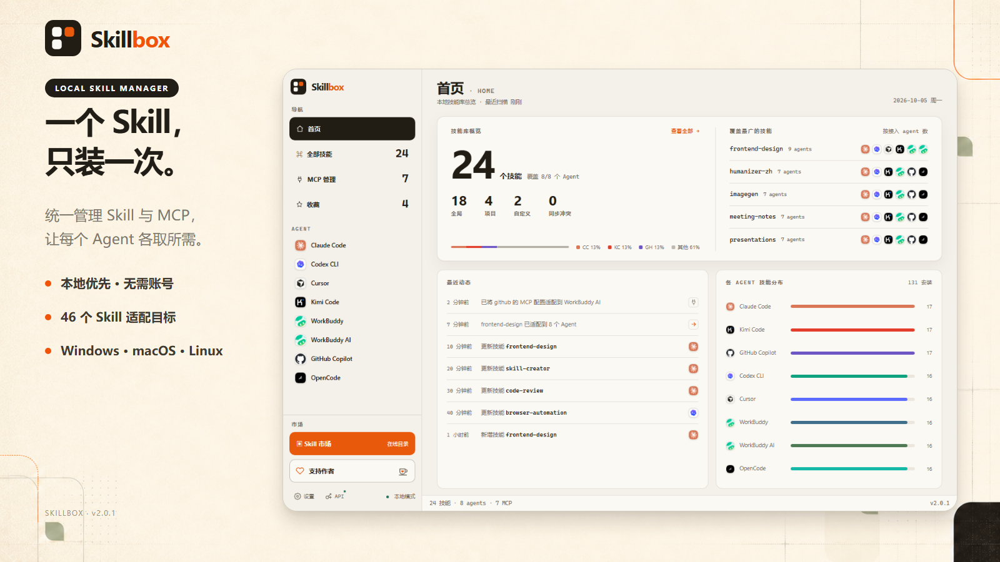
</p>

## 为什么需要 Skillbox

同一个 Skill 往往需要分别复制到 Claude Code、Codex CLI、Cursor 等多个 Agent 目录，MCP 配置也要重复维护。设备一多、工具一多，很快就会出现重复文件、版本不一致和迁移困难。

Skillbox 将本地 Skill 作为母本统一管理，再按需适配到不同 Agent；MCP 配置也能集中查看、比较和同步。扫描、编辑、收藏、集合、历史版本和迁移都在本地完成，无需注册账号。

## 主要功能

- **首页总览**：一眼查看技能数量、Agent 覆盖、范围分布、同步冲突和最近动态
- **统一管理本地 Skill**：扫描全局、项目和自定义目录，集中查看与编辑 `SKILL.md`，支持显示别名、筛选、排序和名称复制
- **按 Agent 独立启用**：内置 46 个 Skill 适配目标，开关点击后立即生效；发现独立副本的差异时，可确认同步至母本
- **MCP 统一管理**：集中查看配置，支持添加、移除、跨 Agent 适配和配置同步；自动检测差异，修改前备份，外部变化后自动刷新
- **来源关联与更新**：关联 GitHub 仓库或本地目录，批量检查全部或选中 Skill 的更新，查看文件差异后再确认更新
- **历史版本与恢复**：编辑、更新和恢复时自动保存快照，也可手动保存；查看历史正文、比较变化，恢复整个 Skill 目录
- **中文翻译**：本地与市场详情支持原文、译文切换，中文简介同步显示在列表；使用自己的 DeepSeek、OpenAI、Claude 或兼容接口，支持本地缓存和 Token 用量统计
- **批量整理与收藏**：多选、集合、批量适配，统一管理 Skill 与 MCP 收藏
- **迁移包与存储位置**：按全部、全局、项目或选中范围导出，导入时检查目标 Agent 并恢复启用关系；也可将通用技能库迁移到其他磁盘
- **90,000+ Skill 市场**：搜索、分页、分类、收藏和指定 Agent 安装，区分“已安装”和“本地同名”
- **离线可用**：本地管理、历史版本和已有译文无需联网；市场浏览、GitHub 来源更新和首次 API 翻译需要联网

### 一份 Skill，多 Agent 适配

<p align="center">
  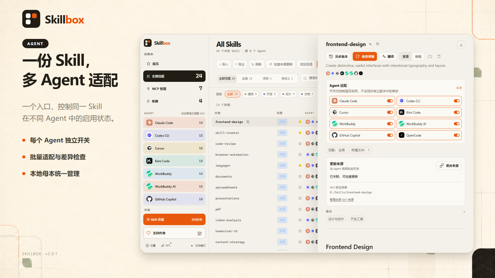
</p>

### MCP 配置，集中管理

<p align="center">
  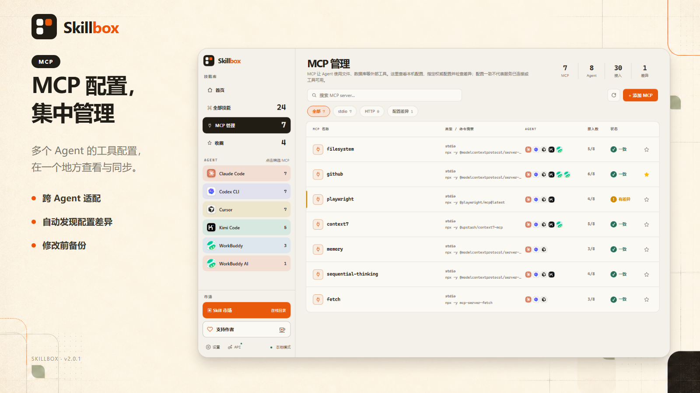
</p>

### 关联来源，检查更新

<p align="center">
  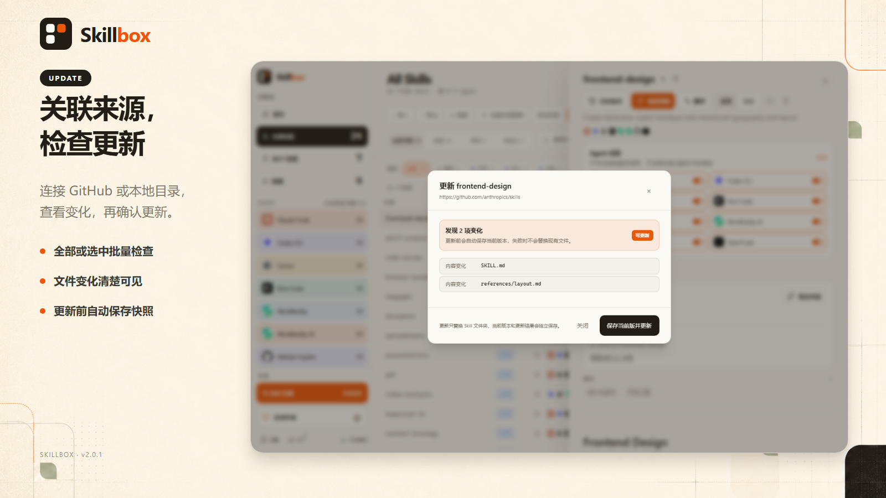
</p>

### 历史版本，随时恢复

<p align="center">
  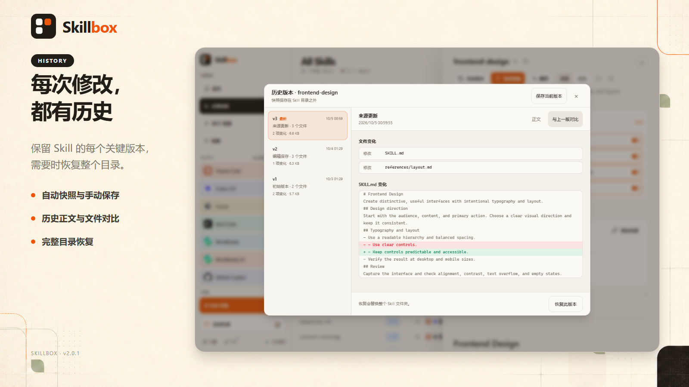
</p>

### 原文译文，一键切换

<p align="center">
  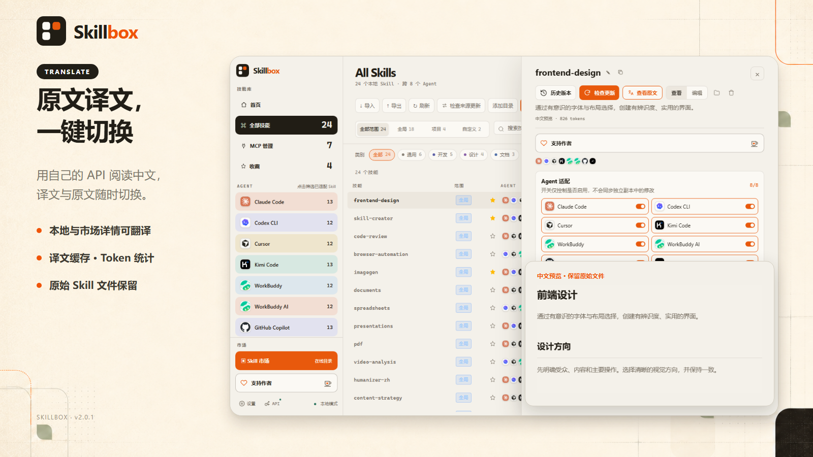
</p>

### 换台设备，完整迁移

<p align="center">
  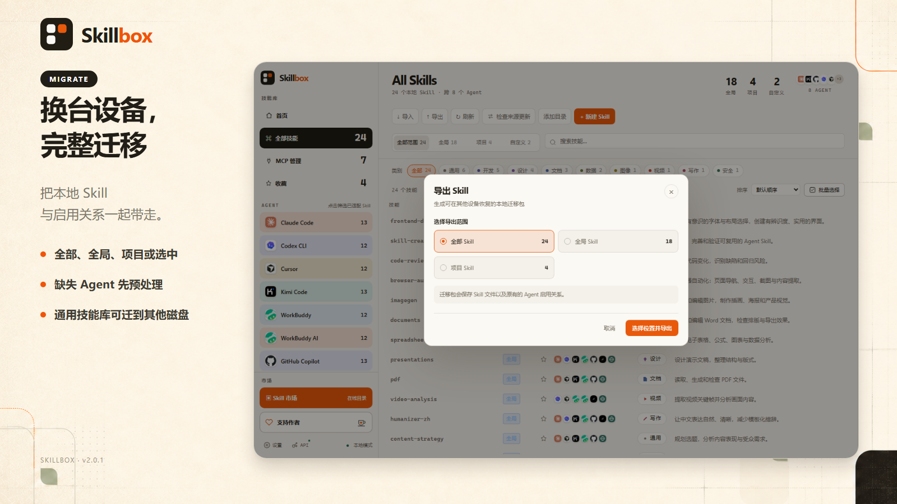
</p>

### 发现、筛选、一键安装

<p align="center">
  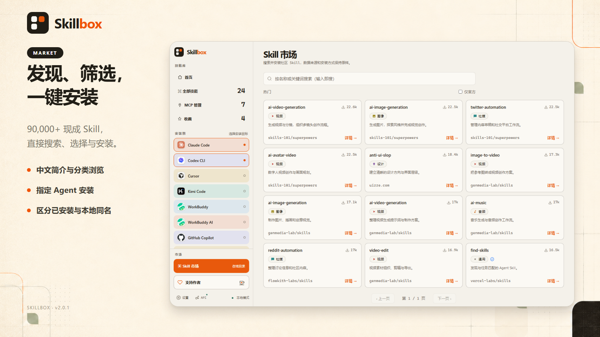
</p>

## 支持的 Agent

当前内置 46 个 Skill 适配目标。Skillbox 只显示本机实际检测到的 Agent，并使用项目内置的品牌彩色图标。MCP 管理按各 Agent 支持的配置格式适配。

<table>
  <tr>
    <td align="center" width="25%">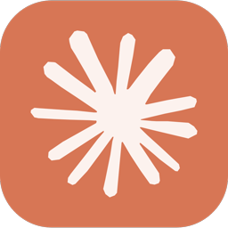<br /><b>Claude Code</b><br /><code>claude-code</code></td>
    <td align="center" width="25%">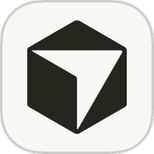<br /><b>Cursor</b><br /><code>cursor</code></td>
    <td align="center" width="25%"><br /><b>GitHub Copilot</b><br /><code>github-copilot</code></td>
    <td align="center" width="25%">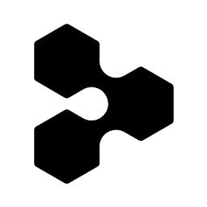<br /><b>Windsurf</b><br /><code>windsurf</code></td>
  </tr>
  <tr>
    <td align="center">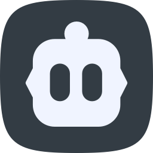<br /><b>Cline</b><br /><code>cline</code></td>
    <td align="center">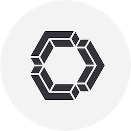<br /><b>Continue</b><br /><code>continue</code></td>
    <td align="center">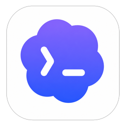<br /><b>Codex CLI</b><br /><code>codex-cli</code></td>
    <td align="center"><br /><b>WorkBuddy</b><br /><code>workbuddy</code></td>
  </tr>
  <tr>
    <td align="center">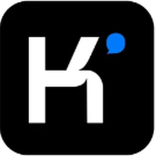<br /><b>Kimi Code</b><br /><code>kimi-code</code></td>
    <td align="center">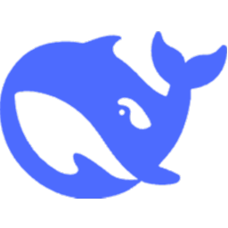<br /><b>DeepSeek Harness</b><br /><code>deepseek-harness</code></td>
    <td align="center"><br /><b>QoderWork</b><br /><code>qoderwork</code></td>
    <td align="center"><br /><b>Qoder CLI</b><br /><code>qoder</code></td>
  </tr>
  <tr>
    <td align="center"><br /><b>TRAE</b><br /><code>trae</code></td>
    <td align="center"><br /><b>Droid CLI</b><br /><code>droid-cli</code></td>
    <td align="center"><br /><b>OB-1</b><br /><code>ob-1</code></td>
    <td align="center"><br /><b>Amp</b><br /><code>amp</code></td>
  </tr>
  <tr>
    <td align="center"><br /><b>Goose</b><br /><code>goose</code></td>
    <td align="center"><br /><b>Junie</b><br /><code>junie</code></td>
    <td align="center">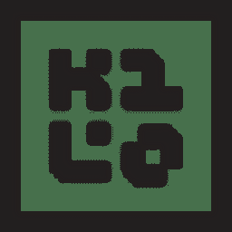<br /><b>Kilo Code</b><br /><code>kilo-code</code></td>
    <td align="center"><br /><b>OpenCode</b><br /><code>opencode</code></td>
  </tr>
  <tr>
    <td align="center">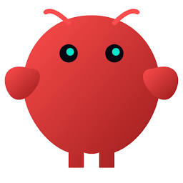<br /><b>OpenClaw</b><br /><code>openclaw</code></td>
    <td align="center"><br /><b>Pear AI</b><br /><code>pear-ai</code></td>
    <td align="center"><br /><b>Roo Code</b><br /><code>roo-code</code></td>
    <td align="center">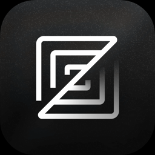<br /><b>Zed</b><br /><code>zed</code></td>
  </tr>
  <tr>
    <td align="center"><br /><b>ZCode</b><br /><code>zcode</code></td>
    <td align="center"><br /><b>Gemini CLI</b><br /><code>gemini-cli</code></td>
    <td align="center"><br /><b>Qwen Code</b><br /><code>qwen-code</code></td>
    <td align="center"><br /><b>Kiro</b><br /><code>kiro</code></td>
  </tr>
  <tr>
    <td align="center"><br /><b>Pi</b><br /><code>pi</code></td>
    <td align="center"><br /><b>CodeBuddy</b><br /><code>codebuddy</code></td>
    <td align="center"><br /><b>MiniMax Code</b><br /><code>minimax-code</code></td>
    <td align="center"><br /><b>Comate</b><br /><code>comate</code></td>
  </tr>
  <tr>
    <td align="center"><br /><b>Lingma</b><br /><code>lingma</code></td>
    <td align="center"><br /><b>CodeArts</b><br /><code>codearts</code></td>
    <td align="center"><br /><b>Hermes</b><br /><code>hermes-agent</code></td>
    <td align="center">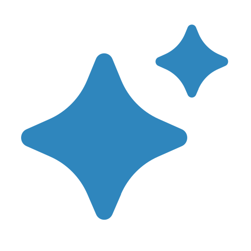<br /><b>AstrBot</b><br /><code>astrbot</code></td>
  </tr>
  <tr>
    <td align="center"><br /><b>Qoder CN</b><br /><code>qoder-cn</code></td>
    <td align="center"><br /><b>TRAE CN</b><br /><code>trae-cn</code></td>
    <td align="center"><br /><b>TraeCode CLI</b><br /><code>traecode-cli</code></td>
    <td></td>
  </tr>
  <tr>
    <td align="center"><br /><b>MiMo Code</b><br /><code>mimo-code</code></td>
    <td align="center"><br /><b>iFlow CLI</b><br /><code>iflow-cli</code></td>
    <td align="center"><br /><b>CatPaw</b><br /><code>catpaw</code></td>
    <td></td>
  </tr>
  <tr>
    <td align="center"><br /><b>WorkBuddy AI</b><br /><code>workbuddy-ai</code></td>
    <td align="center"><br /><b>VS Code Insiders (Copilot)</b><br /><code>vscode-insiders</code></td>
    <td align="center"><br /><b>VS Code (Copilot)</b><br /><code>vscode</code></td>
    <td align="center"><br /><b>豆包工作</b><br /><code>doubao-work</code></td>
  </tr>
</table>

WorkBuddy 国内版与 WorkBuddy AI 国际版可同时识别，分别管理各自的 Skill 与 MCP。VS Code 稳定版与 Insiders 共用 Copilot 的用户级 Skill 目录，MCP 配置按版本独立管理。

此外，Skillbox 支持将 `~/.agents/skills` 作为跨 Agent 共用的 **通用 Skill 目录**。

## 下载安装

前往 [Releases](../../releases/latest) 下载对应平台的安装包：

- Windows：NSIS 安装包
- macOS：Apple 芯片与 Intel 芯片分别构建
- Linux：AppImage 与 Debian 安装包

最新版本 **v2.0.1**：[更新说明](docs/releases/desktop-v2.0.1.md)。v2 新功能见 [v2.0.0 更新说明](docs/releases/desktop-v2.0.0.md)。更新时请先完全退出 Skillbox，再覆盖安装；现有 Skill 和本地数据保留。

也可以通过 npm 自动识别平台、下载并打开对应安装包：

```bash
npx skillbox-app
```

### macOS 首次安装

当前 macOS 安装包尚未完成 Apple 开发者签名和公证。若首次打开时提示“Skillbox 已损坏，无法打开”，请确认安装包来自本仓库的 [Releases](../../releases/latest)，然后：

1. 将 `SkillboxApp.app` 拖入“应用程序”文件夹。
2. 打开“终端”，执行：

```bash
xattr -dr com.apple.quarantine "/Applications/SkillboxApp.app"
```

3. 前往“应用程序”，右键点击 Skillbox，选择“打开”。

如果系统提示无法验证开发者，也可以前往“系统设置 → 隐私与安全”，点击“仍要打开”，具体可参考 [Apple 官方说明](https://support.apple.com/102445)。该安装包未经 Apple 签名与公证，请勿对非官方来源的文件执行上述命令。完成正式签名后将不再需要此操作。

## 本地开发

环境要求：Node.js 18+。

```bash
npm install
npm run dev --workspace=@skillbox/desktop
```

构建桌面端：

```bash
npm run build --workspace=@skillbox/desktop
```

项目使用 npm workspaces。桌面端位于 `apps/desktop`，Skill 安装与发现逻辑位于 `packages/cli`。

完整的桌面端发布流程见 [docs/desktop-release.md](docs/desktop-release.md)。

## 开源协议

[MIT](LICENSE)
